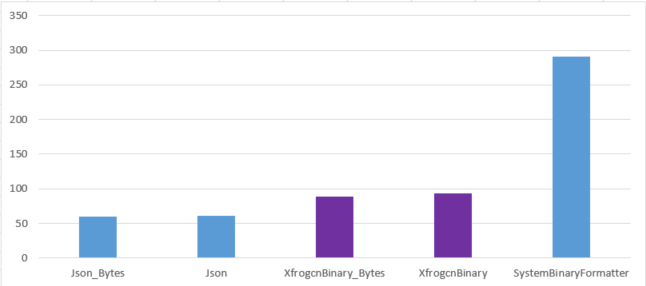
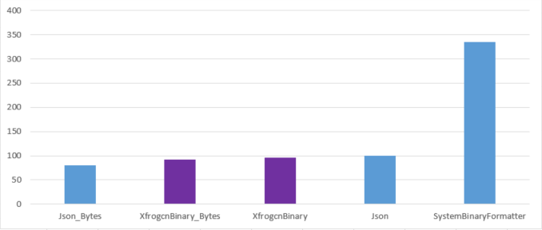

# 高性能二进制序列化库

Xfrogcn.BinaryFormatter是一个.NET下的高性能二进制序列化库，它通过底层的Span以及Emit最大限度地提高性能，BinaryFormatter整体上采用了与System.Text.Json序列化一致的编程API接口，故简单易用，无需过多的学习成本。

## 性能对比

与.NET内置的System.Runtime.Serialization.Formatters.Binary.BinaryFormatter二进制序列化对比，性能最高可达到它的4倍以上，而序列化结果的大小仅只有它的75%。
以下为通过`test/BinaryFormatter.Benchmark`性能测试项目获取的性能数据，其中：

- Json指System.Text.Json，可以看到其性能的确强悍
- XfrogcnBinary指本库
- SystemBinaryFormatter指.NET内置二进制序列化库（System.Runtime.Serialization.Formatters.Binary.BinaryFormatter）
- 类别Stream为采用流化方式序列化
- 类别Bytes为直接序列化为Byte数组或从Byte数组反序列化
- 所有的测试都基于默认配置，（流化方式下默认的缓冲区大小将会明显影响序列化性能）

### 序列化



``` ini
BenchmarkDotNet=v0.12.1, OS=Windows 10.0.18363.1237 (1909/November2018Update/19H2)
Intel Core i7-7500U CPU 2.70GHz (Kaby Lake), 1 CPU, 4 logical and 2 physical cores
.NET Core SDK=5.0.101
  [Host]     : .NET Core 3.1.10 (CoreCLR 4.700.20.51601, CoreFX 4.700.20.51901), X64 RyuJIT
  DefaultJob : .NET Core 3.1.10 (CoreCLR 4.700.20.51601, CoreFX 4.700.20.51901), X64 RyuJIT


```

|                Method | Categories |      Mean |    Error |    StdDev |
|---------------------- |----------- |----------:|---------:|----------:|
|                  Json |     Stream |  61.41 μs | 1.212 μs |  2.154 μs |
|         `XfrogcnBinary` |     Stream |  92.97 μs | 1.691 μs |  2.425 μs |
| SystemBinaryFormatter |     Stream | 291.37 μs | 5.729 μs | 11.174 μs |
|            Json_Bytes |      Bytes |  59.79 μs | 1.160 μs |  1.907 μs |
|   `XfrogcnBinary_Bytes` |      Bytes |  88.67 μs | 1.437 μs |  1.274 μs |

### 反序列化



``` ini

BenchmarkDotNet=v0.12.1, OS=Windows 10.0.18363.1237 (1909/November2018Update/19H2)
Intel Core i7-7500U CPU 2.70GHz (Kaby Lake), 1 CPU, 4 logical and 2 physical cores
.NET Core SDK=5.0.101
  [Host]     : .NET Core 3.1.10 (CoreCLR 4.700.20.51601, CoreFX 4.700.20.51901), X64 RyuJIT
  DefaultJob : .NET Core 3.1.10 (CoreCLR 4.700.20.51601, CoreFX 4.700.20.51901), X64 RyuJIT


```

|                Method |      Mean |    Error |   StdDev |
|---------------------- |----------:|---------:|---------:|
|                  Json | 100.12 μs | 1.933 μs | 2.374 μs |
|         `XfrogcnBinary` |  96.34 μs | 1.631 μs | 1.362 μs |
| SystemBinaryFormatter | 334.68 μs | 2.319 μs | 1.936 μs |
|            Json_Bytes |  80.13 μs | 1.572 μs | 1.989 μs |
|   `XfrogcnBinary_Bytes` |  92.14 μs | 1.814 μs | 3.623 μs |